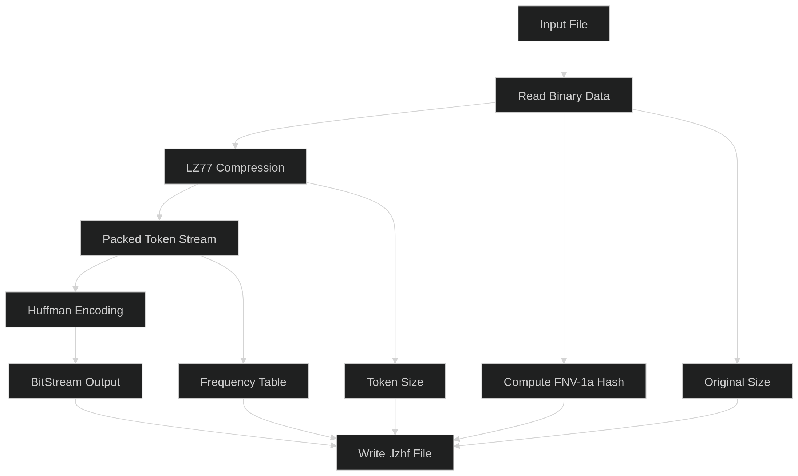
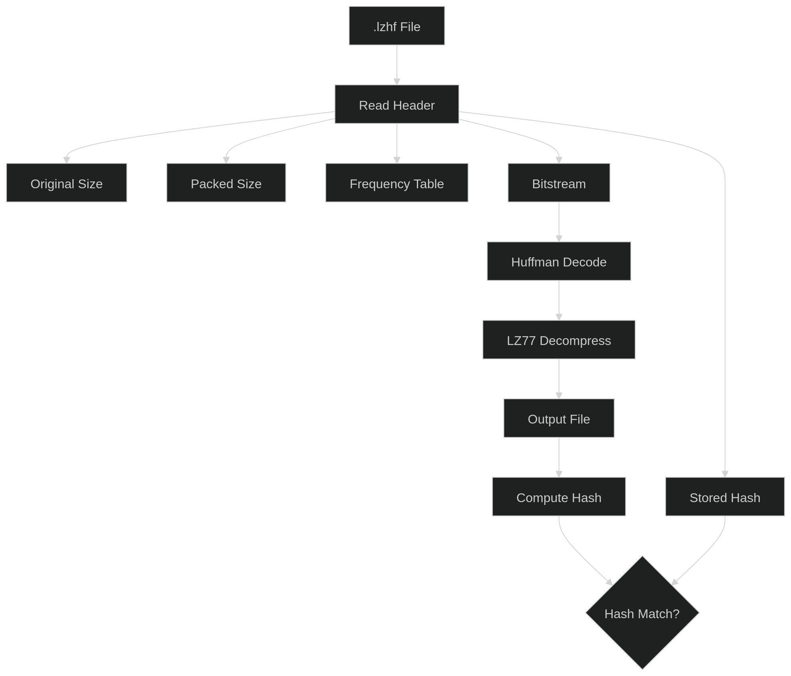

# LZ77 + Huffman Mini Compressor

This project is a lossless compression tool built using **LZ77** and **Huffman coding**. LZ77 removes redundancy by replacing repeated patterns with references, while Huffman coding compresses the resulting data using variable length bit encoding based on symbol frequency. 

The implementation includes bit-level packing, a custom file format, and integrity verification using an FNV-1a hash to ensure exact reconstruction during decompression.

## Build

```console
g++ -std=c++17 -O2 -Iinclude -o lztool src/main.cpp
g++ -std=c++17 -O2 -Iinclude -o compress src/compress.cpp
g++ -std=c++17 -O2 -Iinclude -o decompress src/decompress.cpp
```

## Run

Menu tool:
```console
./lztool
```

## Compression & Decompression Pipelines

#### Compression



#### Decompression




## How It Works

The compression pipeline consists of two main stages: LZ77 for pattern reduction and Huffman coding for entropy encoding.

### Compression

1. **Input Processing**  
   The input file is read in binary form and stored as a byte stream.

2. **LZ77 Compression**  
   A sliding window is used to find repeated sequences in the data.  
   - If a match is found, it is encoded as an *(offset, length)* pair.  
   - Otherwise, the byte is stored as a literal.  
   These tokens are packed into a compact bit-level representation.

3. **Huffman Encoding**  
   The token stream is analyzed to compute symbol frequencies.  
   A Huffman tree is built, assigning shorter bit codes to more frequent symbols.  
   The data is then encoded into a compressed bitstream.

4. **File Construction**  
   The compressed file `.lzhf` contains:
   - Magic header `LZHF`
   - Original file size
   - Token stream size
   - FNV-1a checksum (for verification)
   - Frequency table (for Huffman decoding)
   - Encoded bitstream

---

### Decompression

1. **Header Parsing**  
   The compressed file is read and metadata is extracted, including sizes, frequency table, and checksum.

2. **Huffman Decoding**  
   The bitstream is decoded using the reconstructed Huffman tree to recover the original LZ77 token stream.

3. **LZ77 Decompression**  
   The token stream is processed to rebuild the original data:
   - Literals are copied directly  
   - Back references copy previously reconstructed data  

4. **Verification**  
   A new FNV-1a hash is computed and compared with the stored checksum to ensure lossless reconstruction.